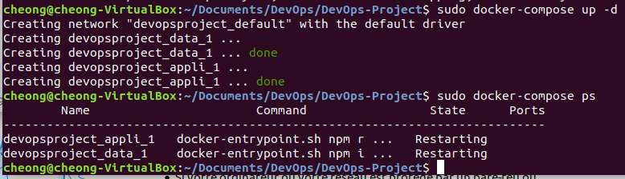

# ECE DevOps Project 2019-2020

## Authors
- CHEONG Loïc : huangloic@hotmail.com or loic.cheong@edu.ece.fr

Student in the group ING 4 SI 03 Inter at ECE Paris

## About this work
This work has been copied-pasted from the NodeJS project for the Web Technologies course at ECE Paris-Lyon. 
This repository is used as a DevOps project. Please notice that this repository is poorer in commits and tags than the NodeJS one. 
You can go to this repo to check out what I did in NodeJS (That's mostly me who did everything ...) : https://github.com/CheongLoic/ECE-NodeJS-Lab-2019. 
I created this repository because my partner in NodeJS wanted to do his DevOps project with Python (or maybe for an other reason ...)

There are : 
- Home page
- Sign In / Sign Up / Sign Out
- Insert/update/delete metrics once logged in
- Retrieve the user’s metrics and display it in a graph
- Only access the user’s metrics, not the other ones

## Problems encounters
- At the beginning, when I finally succeed to make Travis work on my branch 'master' or 'loic', half of the time it failed when I push. I didn't know why it happened while everything seems correct for me. But now, everyting is fixed !
- I don't really know what you expect from us in the Docker part for this project : need Docker Hub ? Update every branch when master branch is committed (thanks to Dockerfile)? or something else ?

## Users' credentials:
- username : loic ; password : 123456

NB: 
- Don't hesitate to play with the UI (User Interface). Enter a wrong username or password to display an error message in the front.
- Moreover don't forget to use `npm run populate` (only in order to run like in the NodeJS project), otherwise these ceredentials won't work.
- Try to log in with the credentials above or create a new account. Afterwards, add/delete metrics 

## Run instructions (at the terminal for the DevOps project)
### Dockerfile
Execute those commands below :
- `sudo docker build -t my-docker .`
- `sudo docker run -d -p 8085:8082 my-docker`
- 

Then open a browser and go to the link http://localhost:8085/ 

Then to stop the container:
- `sudo docker ps`
- `sudo docker stop <container_ID>`

### Docker-compose
Execute `sudo docker-compose up -d`

I tried to test docker-compose.yml several times, but it still doesn't work on the port 8090. I don't know how to fix it. At least I tried

Then to stop it:
- `sudo docker-compose stop`
`sudo docker-compose down`

## Run instructions (at the terminal for the NodeJS project)
After you cloned the repository , execute those commands :
- `git clone https://github.com/CheongLoic/DevOps-Project.git`
- `cd DevOps-Project`
- `npm install` Install all the dependencies
- `npm run populate` Populate the database
- `npm test` Unit tests with mocha and chai 
- `npm run build` Build to convert .ts files into .js files in /dist folder
- `npm start` (run the app) or `npm run dev` (reload the page when changes occurs in the source code)

Then open a browser with the link below http://localhost:8082/

## List of routes (for NodeJS)

* GET
    - http://localhost:8082/ 
    - http://localhost:8082/login
    - http://localhost:8082/logout
    - http://localhost:8082/signup
    - http://localhost:8082/metrics/:usename read raw metrics being unlogged
    - http://localhost:8082/user/:username read user's credentials

* POST
    - http://localhost:8082/metrics/:usename insert metrics unlogged from Postman
    - http://localhost:8082/login
    - http://localhost:8082/signup
    - http://localhost:8082/delete Delete a metric when connected
    - http://localhost:8082/add Add a new metric when connected
    - http://localhost:8082/convert Convert datetime into timestamp
    - http://localhost:8082/convert2 Convert timestamp into datetime
    - http://localhost:8082/user/ Add a new user from Postman

